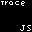

# TraceJS

A simple logging library for javascript

# Table of Contents
- [TraceJS](#tracejs)
- [Table of Contents](#table-of-contents)
- [Functions](#functions)
    - [Asserts](#asserts)
    - [Logging](#logging)
- [What's Next?](#whats-next)
- [Credits](#credits)

# Functions
### Asserts
| Name | Functionality |
| ---- | ------------- |
| assert_eq | Assert if equal |
| assert_nq | Assert if not equal |
| assert | Normal Assert |

### Logging
| Name | Functionality |
| ---- | ------------- |
| error | `console.error`'s inside of the `logs` group |
| warning | `console.warn`'s the message, inside of the `logs` group |
| success | `consol.log`'s the message, inside of the `logs` group |
| logger_group_start | opens the `logs` group |
| logger_group_start | closes the `logs` group |

# What's Next?
You can see all of the stuff im trying to make inside of [TODOS.md](TODOS.md). If there is anything else you want you can
- 1.Create a pull request
- 2.Email me at noaharvan1@gmail.com
# Credits
Just me
